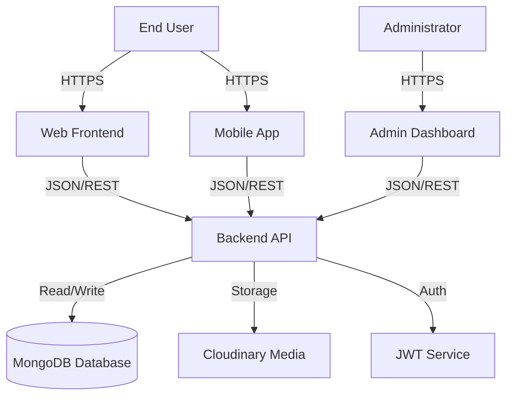

# LifeSync System Architecture

## 📐 High-Level Overview

LifeSync operates on a **Distributed Client-Server Architecture**. It separates concerns between data management (Backend), user interaction (Frontend/Mobile), and administration (Admin Panel).

---

## 🏗️ Monorepo Structure

The project is structured as a logical monorepo, housing all distinct applications within a single repository for easier version tracking and shared context.

| Directory | Purpose | Tech Stack |
| :--- | :--- | :--- |
| **`/backend`** | Core API, Auth, Data Logic | Node.js, Express, Mongoose |
| **`/frontend`** | Patient Web Interface | React, Vite, Tailwind CSS |
| **`/admin`** | Doctor & Admin Control Panel | React, Vite, Tailwind CSS |
| **`/mobile`** | Patient Mobile Interface | React Native, Expo, NativeWind |

---

## 🔌 Core Components

### 1. Backend Service (`/backend`)
The backbone of LifeSync. It exposes a **RESTful API** consumed by all clients.
- **Authentication**: Stateless JWT authentication using `bcrypt` for hashing. Supports multi-provider Single Sign-On (SSO) including Google, Apple, and Microsoft. Middleware ensures role-based access.
- **Controllers**:
    - `userController`: Handles patient registration, booking, and profile updates.
    - `doctorController`: Manages doctor availability, profile, and appointment views.
    - `adminController`: System-wide oversight (adding doctors, viewing global stats).
- **Security**: CORS enabled for specific origins, Helmet for headers (recommended), and input validation.

### 2. Frontend Application (`/frontend`)
A modern Single Page Application (SPA) for patients.
- **State Management**: `AppContext` (React Context API) handles global state effectively without Redux overhead.
- **Routing**: `react-router-dom` manages client-side navigation.
- **UI System**: A custom "Premium" design system built on Tailwind CSS utility classes, utilizing glassmorphism and responsiveness.

### 3. Mobile Application (`/mobile`)
A near-native experience for iOS and Android.
- **Framework**: Built with **Expo** for rapid development and OTA updates.
- **Routing**: **Expo Router** provides file-based routing similar to Next.js.
- **Styling**: **NativeWind** allows sharing Tailwind classes between Web and Mobile, ensuring design consistency.

---

## 🔐 Security Standards

- **Data Encryption**: All sensitive user data (passwords) is hashed before storage.
- **Transmission**: All API communication is designed to run over HTTPS (TLS 1.2+).
- **Session Management**: Tokens are short-lived with refresh mechanisms (planned) and auto-logout on expiry.
- **Access Control**: Strict middleware checks ensure Users cannot access Admin routes, and vice-versa.

---

## 💾 Data Model (Simplified)

- **User**: `_id`, `name`, `email`, `password`, `role`, `googleId`, `appleId`, `microsoftId`, `is_verified`, `appointments[]`
- **Doctor**: `_id`, `name`, `email`, `password`, `speciality`, `slots[]`, `hospitalId` (optional)
- **Appointment**: `_id`, `userId`, `doctorId`, `hospitalId`, `date`, `slot`, `status`, `cancelled`

---

*This document serves as the technical reference for the LifeSync architecture. Last Updated: Dec 30, 2025.*
